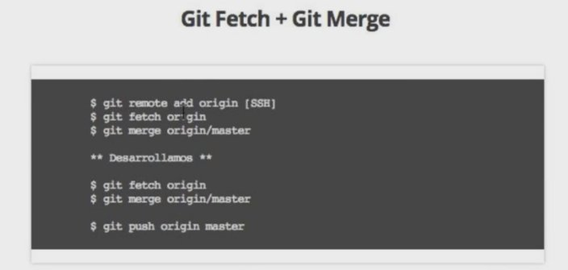
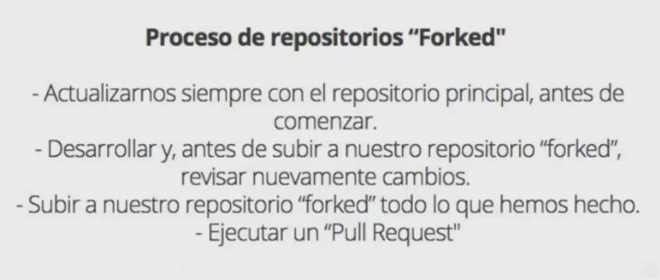
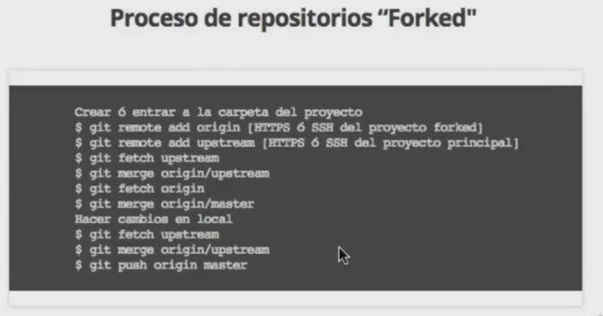
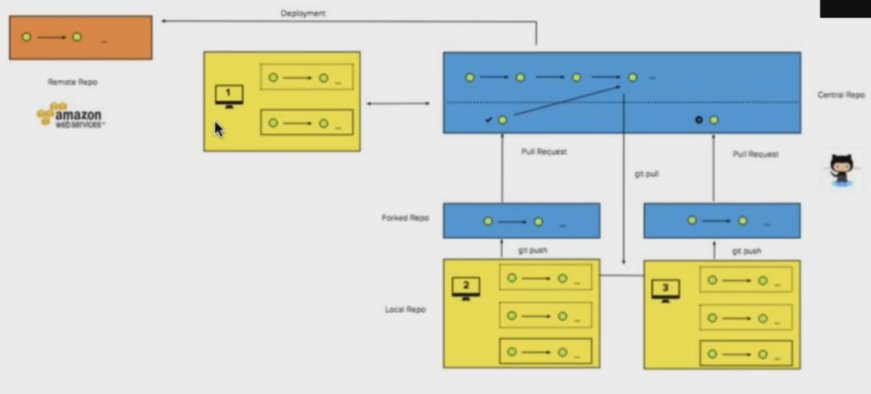

# Git & GitHub


- :link: [git](https://github.com/git/git)
- :link: [git](https://git-scm.com/)
- :link: [gitimmersion.com](http://gitimmersion.com/index.html)
- :link: [learngitbranching](https://learngitbranching.js.org/)
- :link: [GitHub Guides](https://guides.github.com/)
- :link: [github-cheat-sheet](https://github.com/tiimgreen/github-cheat-sheet)
- :link: [EMOJI CHEAT SHEET](https://www.webpagefx.com/tools/emoji-cheat-sheet/)


### Instalación
```
$ sudo apt-get install git
```

### Para comprobar la version
```
$ git --version
```

### Añadir nuestra llave SSH al agente ssh-agent
```
$ eval "$(ssh-agent -s)"
Agent pid 59566

$ ssh-add ~/.ssh/id_rsa
```

### Probar la conexión con Github
```
ssh -T git@github.com
# Attempts to ssh to GitHub
```

### Después configuraremos nuestros datos (usaré los míos):
```
$git config --global user.name "TU NOMBRE"
$git config --global user.email "TU CORREO DE GITHUB"
$git config --global color.ui true
$git config --global --list
```

### Subir cambios a GitHub
```
$ git init
$ git remote add origin [HTTPS or SSH]
$ git remote -v [Para ver en que rama nos encontramos]
```

### Generamos cambios
```
$ git add -A
$ git commit -m "[Mensaje]" - (ABREVIATURA __$ git commit -am "[Mensaje]"__ )
$ git push origin master
$ git checkout [branch/rama/puede ser master ó otra rama del proyecto]
```

### 2.2 Ramas - Practiquemos ramas
```
git branch [nombre]
```

## 2.2 Ramas - git log
### GIT SUPER-LOG

NOTA: Se cambio el nombre de git superlog -> git slog Para que se sea más rapido escriirlo
```
git config --global alias.slog "log --graph --abbrev-commit --decorate --date=relative --format=format:'%C(bold blue)%h%C(reset) - %C(bold green)(%ar)%C(reset) %C(white)%s%C(reset) %C(dim white)- %an%C(reset)%C(bold yellow)%d%C(reset)'" --all
```

### Exploración: Git Clone
```
$ git clone [https or SSH]
```
```
$ git log (comprobar commits)
```

## Git Fetch & Git Merge
### Creamos ó entramos a la carpeta de nuestro proyecto
```
$ git branch -v [Para ver en que rama nos encontramos]
$ git init (si apenas vamos a iniciar)
$ git remote add origin [HTTS or SSH]
$ git branch -a [Para mostrar los branches ocultos]
$ git fetch origin
$ git merge origin/master
```
### Hacen cambios
```
$ git fetch origin
$ git merge origin/master
$ git push origin master
```

### Repositorios "forked" - Crear ó entrar a la carpeta del proyecto
```
$ git remote add origin [HTTPS ó SSH del proyecto forked]
$ git remote add upstream [HTTPS ó SSH del proyecto "main"]
$ git fetch upstream
$ git merge origin/upstream
$ git fetch origin
$ git merge origin/master
```
### Hacer cambios en local
```
$ git fetch upstream
$ git merge origin/upstream
$ git push origin master
```

### Tags
```
- git pull = git fetch + git merge
```

- git remote add origin <DIRECCION_DE_NUESTRO_ REPOSITORIO>

Para subir los cambios al repositorio -> git push origin master

*…or create a new repository on the command line*
```
echo "# xxxxxxxxx-xxxxxxx-xxxxxxx" >> README.md
git init
git add README.md
git commit -m "first commit"
git remote add origin git@github.com:xxxxxxxxxx/xxxxxxxxx-xxxxxxx-xxxxxxx.git
git push -u origin master
```
**…or push an existing repository from the command line**
```
git remote add origin git@github.com:xxxxxxxxxx/xxxxxxxxx-xxxxxxx-xxxxxxx.git
git push -u origin master
```
**…or import code from another repository**
You can initialize this repository with code from a Subversion, Mercurial, or TFS project.


## Git Workflow – Iteración Básica

### Empezar a rastrear la carpeta del proyecto, iniciar un repositorio:
```
git init
```

### Mostrar el punto donde nos encontramos en la iteración, qué archivos podemos guardar o ver el estado:
```
git status
```

### Agregar archivos al área de preparación (Staging):
```
git add favicon.ico

git status
```

### Agregar todos los archivos a Staging Area:
```
git add –A
```

### Primer commit:
```
git commit –m "Creación inicial del proyecto. Assets, Imágenes"
```

### Modificar el código y hacer un segundo Commit:
```
Modificar index.html

git status                                      (Muestra en rojo que index.html fue modificado)

git add index.html

git commit –m "Título y descripción agregadas."
```

### Verificar los cambios realizados:
```
git log

git log --oneline

git log --oneline --graph

git log --graph --abbrev-commit --decorate --date=relative --format=format:'%C(bold blue)%h%C(reset) - %C(bold green)(%ar)%C(reset) %C(white)%s%C(reset) %C(dim white)- %an%C(reset)%C(bold yellow)%d%C(reset)' –all
```

### Asignar un Alias a un comando largo de Git:
```
git config --global alias.superlog "log --graph --abbrev-commit --decorate --date=relative --format=format:'%C(bold blue)%h%C(reset) - %C(bold green)(%ar)%C(reset) %C(white)%s%C(reset) %C(dim white)- %an%C(reset)%C(bold yellow)%d%C(reset)' --all"
```

### Cuando se hizo el ejemplo en el video sobre el alias superlog, se fue la palabra 'git' por eso no funciono, así me funciono a mi:
```
git config --global alias.superlog "log --graph --abbrev-commit --decorate --date=relative --format=format:'%C(bold blue)%h%C(reset) - %C(bold green)(%ar)%C(reset) %C(white)%s%C(reset) %C(dim white)- %an%C(reset)%C(bold yellow)%d%C(reset)' --all"
```
## GIT SUPER-LOG - ALIAS

- :link: [Alias](https://git.wiki.kernel.org/index.php/Aliases)
- :link: [Alias stackoverflow.com question](https://stackoverflow.com/questions/23925998/alias-to-create-aliases#23928098)


En linux los alias creados son se almacenan en al archivo `~.gitconfig` 
```
[alias]
    st = status
    ci = commit -v
```
Formato para hacer "alias"
```
git config --global alias.<alias> <git-command>
```

Formato para remover un alias
```
$ git config --global --unset alias.<NOMBRE-DEL-ALIAS>
```

Cuando se usa **oh-my-zsh** se instala un plug-in de github el cual se encuentra en la ruta
```
.oh-my-zsh/plugins/git/git.plugin.zsh
```

:heavy_exclamation_mark: **NOTA**: :heavy_exclamation_mark: Se cambio el nombre de git superlog -> git slog Para que se sea más rapido escriirlo :heavy_exclamation_mark:

```
git config --global alias.slog "log --graph --abbrev-commit --decorate --date=default --format=format:'%C(bold blue)%h%C(reset) - %C(bold green)(%ar)%C(reset) %C(white)%s%C(reset) %C(dim white)- %an%C(reset)%C(bold yellow)%d%C(reset)' --all"
```

- Crear una rama -> `git checkout -b <nombre_de_nueva_rama>` (Crea nueva rama y se cambia a ella)
- Borrar una rama -> `git branch -d <nombre_de_rama>` (Antes de borrar tiene que estar fusionada)
- Borrar una rama -> `git branch -D <nombre_de_rama>` (Forzar eliminación de rama)
- Modificaciones/rectificar al ultimo commit -> `git commit -am "<comentarios>" --amend`
- Descartar cambios en directorio de trabajo -> `git checkout -- <nombre_de_archivo>`
- Es lo mismo `git add -A git commit -m "<MENSAJE_DE_COMMIT>" a git commit -am "<MENSAJE DE COMMIT>" S`
- `git log -m "mensaje" --amend` -> Rectifica y sustituye el ultimo commit
- `git log --oneline` -> muestra el commit resumido en una linea
- `git log --decorate` -> muestra el commit con el head indicado donde esta posicionado
- `git log --stat` -> explica con detalle en numero de lineas que se convinaron.
- `git log -p` -> es un análisis más profundo del anterior (`git log --stat`).
- `git shortlog` -> agrupa por autor y muestra los titulos del commit.
- `git log --graph --oneline --decorate` -> muestra grafica del de historial del repositorio.


### Git Fetch + Git Merge


### Proyecto de terceros "Proyectos Forks"




### PROCESO DE GITHUB EN PROYECTO EN PRODUCCIÓN



### To set your identity:
```
git config --global user.name "John Doe"
git config --global user.email johndoe@example.com
```

### To set your editor:
```
git config --global core.editor emacs
```

### To enable color:
```
git config --global color.ui true
```

### To stage all changes for commit:
```
git add --all
```

### To stash changes locally, this will keep the changes in a separate changelist
### called stash and the working directory is cleaned. You can apply changes
### from the stash anytime
```
git stash
```
### To stash changes with a message
```
git stash save "message"
```
### To list all the stashed changes
```
git stash list
```
### To apply the most recent change and remove the stash from the stash list
```
git stash pop
```

### To apply any stash from the list of stashes. This does not remove the stash
### from the stash list
```
git stash apply stash@{6}
```
### To commit staged changes
```
git commit -m "Your commit message"
```

### To edit previous commit message
```
git commit --amend
```

### Git commit in the past
```
git commit --date="`date --date='2 day ago'`"
git commit --date="Jun 13 18:30:25 IST 2015"
```
### more recent versions of Git also support --date="2 days ago" directly

### To change the date of an existing commit
```
git filter-branch --env-filter \
  'if [ $GIT_COMMIT = 119f9ecf58069b265ab22f1f97d2b648faf932e0 ]
  then
  export GIT_AUTHOR_DATE="Fri Jan 2 21:38:53 2009 -0800"
  export GIT_COMMITTER_DATE="Sat May 19 01:01:01 2007 -0700"
  fi'
```

### To removed staged and working directory changes
```
git reset --hard
```

### To go 2 commits back
```
git reset --hard HEAD~2
```

### To remove untracked files
```
git clean -f -d
```

### To remove untracked and ignored files
```
git clean -f -d -x
```

### To push to the tracked master branch:
```
git push origin master
```

### To push to a specified repository:
```
git push git@github.com:username/project.git
```

### To delete the branch "branch_name"
```
git branch -D branch_name
```

### To make an exisiting branch track a remote branch
```
git branch -u upstream/foo
```

### To see who commited which line in a file
```
git blame filename
```

### To sync a fork with the master repo:
```
git remote add upstream git@github.com:name/repo.git # Set a new repo
git remote -v # Confirm new remote repo
git fetch upstream # Get branches
git branch -va # List local - remote branches
git checkout master # Checkout local master branch
git checkout -b new_branch # Create and checkout a new branch
git merge upstream/master # Merge remote into local repo
git show 83fb499 # Show what a commit did.
git show 83fb499:path/fo/file.ext # Shows the file as it appeared at 83fb499.
git diff branch_1 branch_2 # Check difference between branches
git log # Show all the commits
git status # Show the changes from last commit
```

### Commit history of a set of files
```
git log --pretty=email --patch-with-stat --reverse --full-index -- Admin\*.py > Sripts.patch
```
### Import commits from another repo
```
git --git-dir=../some_other_repo/.git format-patch -k -1 --stdout <commit SHA> | git am -3 -k
```

### View commits that will be pushed
```
git log @{u}..
```

### View changes that are new on a feature branch
```
git log -p feature --not master
git diff master...feature
```

### Interactive rebase for the last 7 commits
```
git rebase -i @~7
```

### Diff files WITHOUT considering them a part of git
### This can be used to diff files that are not in a git repo!
```
git diff --no-index path/to/file/A path/to/file/B
```

### To pull changes while overwriting any local commits
```
git fetch --all
git reset --hard origin/master
```
### Update all your submodules
```
git submodule update --init --recursive
```

### Perform a shallow clone to only get latest commits
### (helps save data when cloning large repos)
```
git clone --depth 1 <remote-url>
```

### To unshallow a clone
```
git pull --unshallow
```

### Create a bare branch (one that has no commits on it)
```
git checkout --orphan branch_name
```

### Checkout a new branch from a different starting point
```
git checkout -b master upstream/master
```

### Remove all stale branches (ones that have been deleted on remote)
### So if you have a lot of useless branches, delete them on Github and then run this
```
git remote prune origin
```

### The following can be used to prune all remotes at once
```
git remote prune $(git remote | tr '\n' ' ')
```

### Revisions can also be identified with :/text
### So, this will show the first commit that has "cool" in their message body
```
git show :/cool
```

### Undo parts of last commit in a specific file
```
git checkout -p HEAD^ -- /path/to/file
```

### Revert a commit and keep the history of the reverted change as a separate revert commit
```
git revert <commit SHA>
```

### Pich a commit from a branch to current branch. This is different than merge as
### this just applies a single commit from a branch to current branch
```
git cherry-pick <commit SHA1>
```


