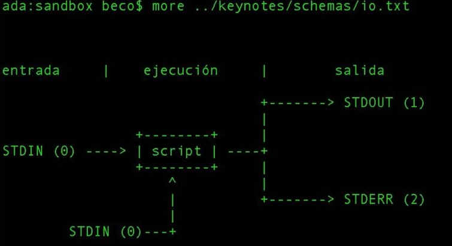
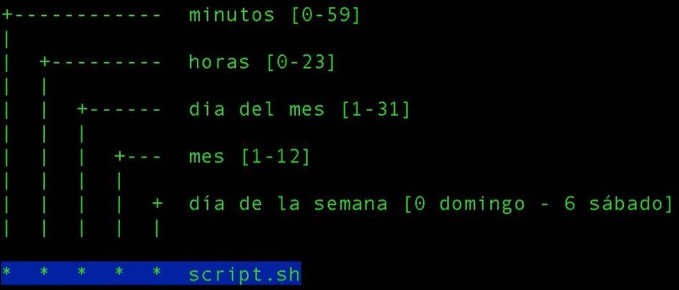

# Terminal y Línea de Comandos

## <a name="INDEX">Índice</a>
0. :link: [Documentos Linux](https://github.com/macknilan/Cuaderno/tree/master/Linux/docs_linux)
1. [Ayuda](#ayuda)
2. [Operadores de encadenamiento - Command­-chaining Operators](#command­_chaining_operators)
3. [Sistema de archivos](#archivos)
    - [Rutas relativas y absolutas](#rutas)
    - [Comandos básicos](#comandos)
    - [Listar directorios](#listado)
    - [Búsqueda](#busqueda)
    - [Standard Input, Standard Output y Standard Error](#standard)
    - [Crontab](#crontab)
    - [Permisos](#permisos)
    - [Enlaces simbólicos](#enlaces)
4. [Compresión y descompresión de archivos](#compresion)
5. [Editando archivos](#edicion)
6. [Introducción a SSH: Olvídate del FTP](#ssh)
7. [Recursos](#recursos)


## <a name="ayuda">Ayuda</a>

Podemos obtener ayuda sobre un comando de las siguientes maneras:

### Comando `man`

```bash
# Muestra el manual del comando
$ man <comando>
```

### Opción <code>--help</code>

```bash
# Muestra la ayuda del comando
$ <comando> --help
```

### Desde la web

[Explain Shell](http://explainshell.com/), un sitio que permite explicar específicamente la mayoría de comandos.

**[[ Volver al índice ]](#INDEX)**

## <a name="command­_chaining_operators">Operadores de encadenamiento - Command­-chaining Operators</a>

This Article aims at throwing light on frequently used command­-chaining operators, with short descriptions and corresponding examples which surely will increase your productivity and lets you write short and meaningful codes beside reducing system load, at times.

#### 1. Ampersand Operator (&)
The function of `&` is to make the command run in background. Just type the command followed with a white space and `&`. You can execute more than one command in the background, in a single go.

Run one command in the background:
```bash
mack@localhost:~$ ping ­c5 www.mack.com &
```
Run two command in background, simultaneously:
```bash
root@localhost:/home/mack# apt-get update & apt-get upgrade &
```
#### 2. semi-colon Operator (;)
The semi-colon operator makes it possible to run, several commands in a single go and the execution of command occurs sequentially.
```bash
root@localhost:/home/mack# apt-get update ; apt-get upgrade ; mkdir test
```
The above command combination will first execute update instruction, then upgrade instruction and finally will create a `test` directory under the current working directory.

#### 3. AND Operator (&&)
The AND Operator (&&) would execute the second command only, if the execution of first command **SUCCEEDS**, i.e., **the exit status of the first command is 0**. This command is very useful in checking the execution status of last command.

For example, I want to visit website mack.com using links command, in terminal but before that I need to check if the host is live or not.
```bash
root@localhost:/home/mack# ping -c3 www.mack.com && links www.mack.com
```

#### 4. OR Operator (||)
The `OR` Operator **(||)** is much like an `else` statement in programming. The above operator allow you to execute second command only if the execution of first command fails, i.e., the exit status of first command is ‘1‘.

For example, I want to execute `apt-get update` from non-root account and if the first command fails, then the second `links www.mack.com` command will execute.
```bash
mack@localhost:~$ apt-get update || links mack.com
```
In the above command, since the user was not allowed to update system, it means that the exit status of first command is `1` and hence the last command ‘links mack.com‘ gets executed.

What if the first command is executed successfully, with an exit status `0`? Obviously! Second command won’t execute.
```bash
mack@localhost:~$ mkdir test || links mack.com
```
Here, the user creates a folder `test` in his home directory, for which user is permitted. The command executed successfully giving an exit status `0` and hence the last part of the command is not executed.

#### 5. NOT Operator (!)
The `NOT` Operator **(!)** is much like an `except` statement. This command will execute all except the condition provided. To understand this, create a directory `mack` in your home directory and `cd` to it.
```bash
mack@localhost:~$ mkdir mack 
mack@localhost:~$ cd mack
```
Next, create several types of files in the folder `mack`.
```bash
mack@localhost:~/mack$ touch a.doc b.doc a.pdf b.pdf a.xml b.xml a.html b.html
```
See we’ve created all the new files within the folder `mack`.
```bash
mack@localhost:~/mack$ ls 
a.doc  a.html  a.pdf  a.xml  b.doc  b.html  b.pdf  b.xml
```
Now delete all the files except `html` file all at once, in a smart way.
```bash
mack@localhost:~/mack$ rm -r !(*.html)
```
Just to verify, last execution. List all of the available files using ls command.
```bash
mack@localhost:~/mack$ ls 

a.html  b.html
```
#### 6. AND – OR operator (&& – ||)
The above operator is actually a combination of `AND` and `OR` Operator. It is much like an `if-else` statement.

For example, let’s do ping to mack.com, if success echo `Verified` else echo `Host Down`.
```bash
mack@localhost:~/mack$ ping -c3 www.mack.com && echo "Verified" || echo "Host Down"
```
Sample Output
```bash
PING www.mack.com (212.71.234.61) 56(84) bytes of data. 
64 bytes from www.mack.com (212.71.234.61): icmp_req=1 ttl=55 time=216 ms 
64 bytes from www.mack.com (212.71.234.61): icmp_req=2 ttl=55 time=224 ms 
64 bytes from www.mack.com (212.71.234.61): icmp_req=3 ttl=55 time=226 ms 

--- www.mack.com ping statistics --- 
3 packets transmitted, 3 received, 0% packet loss, time 2001ms 
rtt min/avg/max/mdev = 216.960/222.789/226.423/4.199 ms 
Verified
```
Now, disconnect your internet connection, and try same command again.
```bash
mack@localhost:~/mack$ ping -c3 www.mack.com && echo "verified" || echo "Host Down"
Sample Output
ping: unknown host www.mack.com 
Host Down
```
#### 7. PIPE Operator (|)
This PIPE operator is very useful where the output of first command acts as an input to the second command. For example, pipeline the output of `ls -l` to `less` and see the output of the command.
```bash
mack@localhost:~$ ls -l | less
```
#### 8. Command Combination Operator {}
Combine two or more commands, the second command depends upon the execution of the first command.

For example, check if a directory `bin` is available or not, and output corresponding output.
```bash
mack@localhost:~$ [ -d bin ] || { echo Directory does not exist, creating directory now.; mkdir bin; } && echo Directory exists.
```
#### 9. Precedence Operator ()
The Operator makes it possible to execute command in precedence order.
```bash
Command_x1 &&Command_x2 || Command_x3 && Command_x4.
```
In the above pseudo command, what if the Command_x1 fails? Neither of the Command_x2, Command_x3, Command_x4 would executed, for this we use Precedence Operator, as:
```bash
(Command_x1 &&Command_x2) || (Command_x3 && Command_x4)
```
In the above pseudo command, if Command_x1 fails, Command_x2 also fails but Still Command_x3 and Command_x4 executes depends upon exit status of Command_x3.

#### 10. Concatenation Operator (\)
The Concatenation Operator **(\)** as the name specifies, is used to concatenate large commands over several lines in the shell. For example, The below command will open text file **test(1).txt**.
```bash
mack@localhost:~/Downloads$ nano test\(1\).txt
```

**[[ Volver al índice ]](#INDEX)**


## <a name="archivos">Sistema de archivos</a>

Olvidémonos de C:, D:, E:, etc :)

### <a name="rutas">Rutas relativas y absolutas</a>

En Linux, si existe el usuario <code>braulio</code>, entonces también existe una carpeta en la ruta <code>/home/braulio</code>.

Crearemos una carpeta dentro de <code>braulio</code> llamada <code>images</code>.

Entonces podemos acceder a estas carpetas mediante:

#### Ruta absoluta

```bash
# Para acceder a la carpeta images
$ cd /home/braulio/images

# Para acceder a la carpeta braulio
$ cd /home/braulio

# Para acceder a la carpeta home
$ cd /home
```

Donde el <code>/</code> inicial se refiere a la raiz del sistema de archivos.

#### Rutas relativas

```bash
# Si estuviera en la carpeta /home/braulio, accedo a images con:
$ cd images
$ cd ~/images
$ cd ./images

# Si estoy en la carpeta /home/braulio/images regreso a la carpeta padre con:
$ cd .. # /home/braulio

# Y a la carpeta padre del padre con:
$ cd ../.. # /home
```

Donde:

- El `~` significa la carpeta del usuario, es decir, /home/braulio.
- El `.` se refiere a la carpeta en sí misma.
- El `..` se refiere a la carpeta padre.

**[[ Volver al índice ]](#INDEX)**

### <a name="comandos">Comandos básicos</a>

#### Creación de archivos y directorios

```bash
# Creamos el archivo index.html
$ touch index.html

# Creamos el directorio logs
$ mkdir logs

# Creamos varios directorios
$ mkdir media templates

# Creamos directorios dentro de directorios, aunque no existan
$ mkdir -p public/{images,css,js} # Crea el archivo public y dentro de este la carpeta images, css y js
```

#### Moverse entre directorios

```bash
# Cambiar a cierto directorio
$ cd <directorio>

# Ir al directorio padre
$ cd ..

# Ir al directorio /home/braulio desde cualquier lugar
$ cd ~
$ cd

# Ir al directorio raiz
$ cd /
```

#### Copiar, mover, renombrar, borrar

```bash
# Copiar directorio
$ cp braulio braulito
# Ahora tengo dos directorios, uno llamado braulio y otro braulito

# Copiar archivos
$ cp index.html inicio.html
# Ahora tengo dos archivos, uno llamado index.html y otro inicio.html

# Copiar archivos dentro de un directorio a otro
$ cp braulio/* otrodirectorio

# Copiar sólo los archivos html
$ cp braulio/*.html otrodirectorio

# Renombra la carpeta braulito a brau
$ mv braulito brau

# Mueve la carpeta brau al directorio padre
$ mv brau ..

# Mueve la carpeta index que está en la carpeta padre a mi directorio actual
$ mv ~/brau .

# Si no funciona podemos usar el parámetro -f (Force)
$ mv -f ~/brau .

# Borra un archivo
$ rm inicio.html

# Borra los archivos .html
$ rm *.html

# Borra una carpeta
$ rm -rf braulio
```

#### Descarga de archivos

```bash
# Descargar un archivo usando wget
$ wget http://nodejs.org/dist/v0.10.22/node-v0.10.22.tar.gz

# Descargar un archivo usando curl
$ curl http://nodejs.org/dist/v0.10.22/node-v0.10.22.tar.gz
```

#### Para los curiosos

```bash
# Ver el espacio ocupado en la carpeta actual
$ du

# Lo mismo pero para humanos
$ du -hs

# Ver el tamaño de cierto archivo
$ du -hs index.html

# Ver de cierta carpeta
$ du -hs mack

# Ver el espacio creado desde la pocisión actual con la profundidad de 1
$ du -h -d 1

# Ver mi directorio actual
$ pwd

# Ver el contenido de un archivo página por página
$ less archivo.html
# Después de verlo podemos salir presionando q

# Concatenar el contenido de varios archivos y mostrarlos
$ cat archivo.html estilo.css

# Ver desde donde se ejecuta un comando
$ which cat
# /bin/cat

# Ver como funciona cierto comando
$ type ls
# ls es un alias de 'ls --color=auto' (en Ubuntu)

# Ver todos los comandos que he escrito desde el inicio de los tiempos
$ less ~/.bash_history
```

**[[ Volver al índice ]](#INDEX)**

### <a name="listado">Listar directorios</a>

```bash

# Lista recursivamente la estructura de árbol de un directorio incluyendo tanto archivos
como directorios (**NOTA:** No viene pre-instalado así que hay que instalarlo primero con su
administrador de paquetes preferido: para RHEL/CentOS/Fedora yum install tree para
Debian/Mint/Ubuntu, para OS X `brew install tree`)
$ apt-get install tree

# Muestra recursivamente la estructura de árbol de un directorio pero sólo hasta el
primer subnivel de directorios
$ tree -L 1

# Muestra recursivamente la estructura de árbol de un directorio incluyendo tanto
archivos como directorio ocultos
$ tree -a

# Muestra recursivamente la estructura de árbol de un directorio tomando en cuenta
sólo los directorios
$ tree -d

# Muestra recursivamente la estructura de árbol de un directorio tomando en cuenta
sólo los directorios y hasta el primer subnivel
$ tree -dL 1


# Muestra carpetas y archivos en el directorio actual
$ ls

# Muestra carpetas y archivos en un directorio
$ ls <directorio>

# Muestra las carpetas y archivos incluyendo los ocultos, y los muestra en forma de columnas.
$ ls -la

# Similar al anterior en Ubuntu
$ ll

# Puedes crear tu propio comando con
$ alias myll='ls -la'

# Y lo usas con
$ myll

# Ver la salida anterior mostrando cierto patrón
$ ll | grep html
# Muestra la lista resaltando todos los que contienen el string html en su nombre

# Guardar la salida a un archivo
$ ll > listado1.txt
# Se crea un archivo listado1.txt con la salida de ll
```

**[[ Volver al índice ]](#INDEX)**

### <a name="busqueda">Búsqueda</a>

##### find
```bash
# To find files by case-insensitive extension (ex: .jpg, .JPG, .jpG):
find . -iname "*.jpg"

# To find directories:
find . -type d

# To find files:
find . -type f

# To find files by octal permission:
find . -type f -perm 777

# To find files with setuid bit set:
find . -xdev \( -perm -4000 \) -type f -print0 | xargs -0 ls -l

# To find files with extension '.txt' and remove them:
find ./path/ -name '*.txt' -exec rm '{}' \;

# To find files with extension '.txt' and look for a string into them:
find ./path/ -name '*.txt' | xargs grep 'string'

# To find files with size bigger than 5 Mebibyte and sort them by size:
find . -size +5M -type f -print0 | xargs -0 ls -Ssh | sort -z

# To find files bigger than 2 Megabyte and list them:
find . -type f -size +200000000c -exec ls -lh {} \; | awk '{ print $9 ": " $5 }'

# To find files modified more than 7 days ago and list file information
find . -type f -mtime +7d -ls

# To find symlinks owned by a user and list file information
find . -type l --user=username -ls

# To search for and delete empty directories
find . -type d -empty -exec rmdir {} \;

# To search for directories named build at a max depth of 2 directories
find . -maxdepth 2 -name build -type d

# To search all files who are not in .git directory
find . ! -iwholename '*.git*' -type f

# To find all files that have the same node (hard link) as MY_FILE_HERE
find . -type f -samefile MY_FILE_HERE 2>/dev/null

# To find all files in the current directory and modify their permissions
find . -type f -exec chmod 644 {} \;
```

```bash
# Muestra todos los archivos y carpetas recursivamente dentro del directorio actual
$ find

# Lo mismo pero más complicado
$ find .

# Muestra recursivamente solo los archivos que tengan .html en la carpeta actual
$ find . -name \*.html

# Lo mismo
$ find . -name '*.html'

# Lo mismo pero con grep
$ find . | grep .html

# Lo mismo pero en otra carpeta
$ find <otracarpeta> | grep .html

# El comando locate guarda una base de datos de todos los archivos y carpetas que tenemos, actualiza estos cada cierto tiempo
# Para actualizarlo ahora mismo

$ updatedb

# Para encontrar cierto archivo o carpeta con el nombre brau
$ locate brau
```

##### grep
```bash
# Search a file for a pattern
grep pattern file

# Case insensitive search (with line numbers)
grep -in pattern file

# Recursively grep for string <pattern> in folder:
grep -R pattern folder

# Read search patterns from a file (one per line)
grep -f pattern_file file

# Find lines NOT containing pattern
grep -v pattern file

# You can grep with regular expressions
grep "^00" file  #Match lines starting with 00
grep -E "[0-9]{1,3}\.[0-9]{1,3}\.[0-9]{1,3}\.[0-9]{1,3}" file  #Find IP add

# Find all files which match {pattern} in {directory}
# This will show: "file:line my research"
grep -rnw 'directory' -e "pattern"

# Exclude grep from your grepped output of ps.
# Add [] to the first letter. Ex: sshd -> [s]shd
ps aux | grep '[h]ttpd'

# Colour in red {bash} and keep all other lines
ps aux | grep -E --color 'bash|$'
```

**[[ Volver al índice ]](#INDEX)**

### <a name="standard">Standard Input, Standard Output y Standard Error</a>



- STDIN = 0
- STDOUT = 1
- STDERR = 2

Independiente del lenguaje, cualquier programa tiene un flujo de entrada de datos, un flujo de salida y un modo de capturar errores.

En la terminal, podemos tener este mismo flujo de datos gracias a `“<” y “>”` `>>` es para **concatenar**.
Nuestro ejemplo fue:
```bash
# De un archivo llamado operaciones.bc, abrelo usando bc, y el resultado, mandalo a resultado
$ bc -q < operaciones.bc > resultado

# 1ro lee lo que se encuentra en "operaciones.bc" y lo manda a "bc -p", despues manda el STDOUT a "resultado" y los errores STDERR los manda al archivo errores
$ bc -p < operaciones.bc 1> resultado 2> errores

```
`| pipe` = Manda el STDOUT o el resultado a otro comando o programa:
```bash
cat operaciones.bc | bc -q
```
`> mayor que` = Imprime el STDOUT a un archivo
```bash
operaciones.bc > resultados.txt
```
`< menor que` = Lo mismo que el pipe, pero sin necesidad de ejecutar otro comando
```bash
bc -q < operaciones.bc
```

```python
# CODIGO PARA EJEMPLIFICAR STANDARD INPUT, STANDARD OUTPUT Y STANDARD ERROR
# standardIOERR.py
import  sys
import time
print"numero:"
d = input()
i = 0
while(True):
    i =i+1
    if((i % d) ==0):
            sys.stdout.write("El %d  es multiplo de %d \n " %(i,d))
    else:
            sys.stderr.write("NO!!! ALARMA: el %d No es multiplo de %d!!!\n" %(i,d))
    time.sleep(1)
```

**[[ Volver al índice ]](#INDEX)**

### <a name="crontab">Crontab</a>


Una de las herramientas más potentes de los sistemas UNIX, que nos permite programar la ejecución de diferentes scripts. Con crontab podemos agendar todo lo que necesitemos para facilitar nuestro trabajo y automatizar tareas.
`contrab -l` despliega el crontab que tenemos instalado. Cada una de las primeras 5 columnas que tenemos al correr este comando especifica en qué momento exacto queremos que se ejecute la tarea que vamos a definir en la sexta columna.

 1 Columna 1: minuto 0-59
 2 Columna 2: hora 0-23
 3 Columna 3: día del mes 1-31
 4 Columna 4: mes 1-12
 5 Columna 5: día de la semana 0-7 (donde 0 y 7 equivalen a domingo)
 6 Columna 6: script o comando que queremos que se ejecute

 - `crontab -l`: Lista las tareas que tengo agendadas.
 - `crontab -e`: Edita las tareas que tengo agendadas.
```bash
0          - todos los valores
1-10      - de 1 a 10
*/5        - cada 5
1,2,3,9    - ejecutate estas horas
```

**[[ Volver al índice ]](#INDEX)**


### <a name="permisos">Permisos</a>

Si usamos el listado en esta carpeta lo que encontremos es:

```bash
drwxr-xr-x  3 mack mack  4096 nov 22 09:35 ./
drwxrwxr-x 33 mack mack  4096 nov 21 23:13 ../
drwxrwxr-x  8 mack mack  4096 nov 22 10:18 .git/
-rw-rw-r--  1 mack mack 11325 nov 21 23:13 LICENSE
-rw-rw-r--  1 mack mack  6920 nov 22 10:18 README.md
```

Vemos 7 columnas las cuales indican:

1. Permisos
2. Directorios
3. Usuario
4. Grupo
5. Tamaño en bytes
6. Fecha de modificación
7. Archivo o directorio

Tomando la primera columna la dividimos en cuatro subcolumnas y las separamos por <code>|</code> para explicarlo mejor, en el caso del archivo README.md

```bash
-|rw-|rw-|r--
```

- La primera columna muestra <code>-</code> y nos indica que <code>README.md</code> es un archivo, caso contrario sería un directorio y mostraría <code>d</code>.

- La segunda columna muestra <code>rw-</code> y nos indica que este archivo tiene permisos de lectura (r), de escritura (w), mas no de ejecución(x) **por parte del usuario**.

- La tercera columna muestra <code>rw-</code> y nos indica que este archivo tiene permisos de lectura (r), de escritura (w), mas no de ejecución(x) **por parte del grupo**.

- La tercera columna muestra <code>r-</code> y nos indica que este archivo tiene permisos de lectura (r), mas no de escritura (w) ni de ejecución(x) **por parte de otros**.

#### Cambiando permisos

Cada permiso está representado por un número de la siguiente manera:

- Read (r) vale 4
- Write (w) vale 2
- Execute (x) vale 1

Sabiendo esto puedo cambiar los permisos del archivo index.html:

```bash
# Cambiando los permisos de index.html
$ chmod 775 index.html
```

Donde:
- El primer 7 viene de <code>4+2+1</code>, es decir, que <code>index.html</code> tiene permisos de <code>rwx</code> para el usuario.
- Igual que el anterior pero para el grupo.
- El 5 viene de <code>4+1</code>, es decir, que <code>index.html</code> tiene permisos de <code>r-x</code> para otros.

Para los directorios:

```bash
# Cambiando los permisos de la carpeta mack
$ chmod 444 mack
# Ahora la carpeta mack es de sólo lectura.

# Cambiando los permisos de la carpeta mack y de todo su contenido recursivamente
$ chmod -R 444 mack 
```

#### Cambiando de propietario y grupo

```bash
# index.html pertenecía al usuario brau, ahora pertenecerá al usuario deicy
$ chown deicy index.html

# index.html pertenecía al grupo brau, ahora pertenecerá al grupo deicy
$ chgrp deicy index.html

# Juntando ambos comandos
$ chown deicy:deicy index.html
```

### Cambiando de usuario

```bash
# Estoy con el usuario braulio, y quiero usar el usuario deicy
$ su deicy

# Quiero ejecutar los comandos como root
$ sudo mkdir carpeta
# Crea una carpeta como superman
```

**[[ Volver al índice ]](#INDEX)**

### <a name="enlaces">Enlaces simbólicos</a>

Los enlaces simbólicos sirven para tener una referencia a un archivo o carpeta y acceder a esta sin tener que ir a la ruta.

El ejemplo más básico lo vemos en los hostings que usan CPanel, donde encontramos la carpeta <code>public_html</code> y el enlace simbólico <code>www</code>, si entramos a ambos, veremos el mismo contenido.

```bash
# Para crear un enlace simbólico
$ ln -s path/to/the/target/directory name-of-symlink
```

```bash
# Creamos el enlace simbólico www para public_html
$ ln -ls ~/public_html ~/www
```

**[[ Volver al índice ]](#INDEX)**

## <a name="compresion">Compresión y descompresión de archivos</a>

### Descompresión

```bash
# Archivos tar.gz
$ tar -zxf archivo.tar.gz

# Archivos gz
$ gzip -d archivo.gz

# Archivos zip
$ unzip archivo.zip
```

### Compresión

```bash
# Empaqueto y comprimo la carpeta braulio y la llamo archivo.tar.gz
$ tar -czf archivo.tar.gz braulio

# Comprimo la carpeta braulio y la llamo archivo.gz
$ gzip -q archivo.gz

# Comprimo la carpeta braulio y la llamo archivo.zip
$ zip archivo.zip archivo
```

**[[ Volver al índice ]](#INDEX)**

## <a name="edicion">Editando archivos</a>

```bash
# Usando nano
$ nano index.html

# Usando vi
$ vi index.html

# Usando vim
$ vim index.html
```

- En *nano* editamos el archivo y lo guardamos presionando <kbd>Ctrl</kbd> + <kbd>O</kbd>, salimos con <kbd>Ctrl</kbd> + <kbd>X</kbd>.
- En *vi* o *vim*, para editar presionamos la tecla <kbd>i</kbd>, editamos lo que necesitamos, presionamos la tecla <kbd>Esc</kbd> y guardamos y salimos presionando <kbd>:wq</kbd>.

Más información en los [Recursos](#recursos).

**[[ Volver al índice ]](#INDEX)**

## <a name="ssh">Introducción a SSH: Olvídate del FTP</a>

SSH (Secure Shell) es la manera rápida de acceder a equipos remotos y manejarlos mediante la consola.

### Llaves SSH

```bash
# Genero una llave SSH
$ ssh-keygen -t rsa -C "braulio@soncco.com"
```

- Primero nos pide un lugar donde estará guardado nuestra llave, generalmente está en el directorio <code>~/.ssh</code>
- Luego nos pide una contraseña, ponemos la que nos guste.
- Se han creado dos archivos:
  - <code>~/.ssh/id_rsa</code> (La clave privada)
  - <code>~/.ssh/id_rsa.pub</code> (La clave pública)


### Acceso remoto, olvidándonos de FTP

Pronto

**[[ Volver al índice ]](#INDEX)**

## <a name="recursos">Recursos</a>

### Comandos
- [Linux Command](http://www.linuxcommand.org/) - Aprender la consola
- [The Linux Cookbook](http://www.dsl.org/cookbook/cookbook_toc.html) - Tips y técnicas para uso diario
- [Linux in a Nutshell](http://my.safaribooksonline.com/0596009305?portal=oreilly) - Directorio de comandos Linux
- [Explain Shell](http://explainshell.com/) - Guía detallada de cada comando Linux

### Edición
- [Open VIM](http://www.openvim.com/) - Tutorial interactivo para aprender VIM

### Tips
- [8 Técnicas al usar la consola](http://www.howtogeek.com/110150/)

**[[ Volver al índice ]](#INDEX)**


